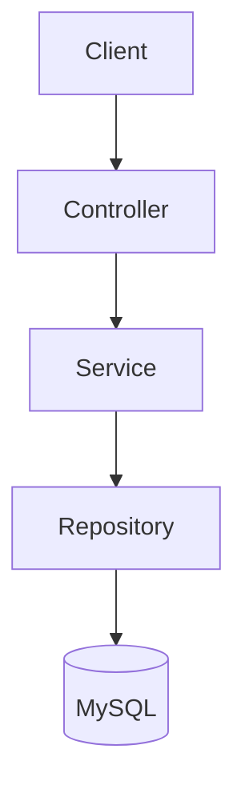
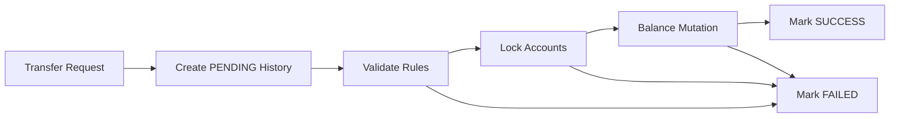

# Mini Core Banking System


A learning-focused Spring Boot backend prototype for exploring financial transfer orchestration, validation rules, transfer lifecycle states, pessimistic locking, and transaction-boundary considerations.

This is not a production banking platform. The project is designed as a backend engineering portfolio project that models financial-system concerns in a compact, reviewable codebase.

---

## Highlights

| Area | What This Project Demonstrates |
| --- | --- |
| Layered backend design | Controller -> Service -> Repository structure using Spring Boot |
| Transfer validation | Self-transfer prevention, positive amount validation, sufficient balance checks |
| Transfer lifecycle | `PENDING`, `SUCCESS`, and `FAILED` status modeling |
| Concurrency exploration | JPA `PESSIMISTIC_WRITE` locking for account balance updates |
| Transaction design | Practical transaction-boundary learning around transfer orchestration |
| Exception handling | Centralized business exception handling with JSON responses |
| Financial architecture direction | Future path toward idempotency, audit trails, and ledger-oriented design |

---

## Project Positioning

This repository is best understood as:

- A Spring Boot backend learning project
- A financial transfer orchestration prototype
- A transaction consistency and locking study
- A portfolio project for backend design discussion

It is not intended to represent:

- A production-grade financial transaction engine
- A complete accounting or ledger system
- A real bank core system
- A certified money-movement platform

The goal is to show engineering judgment: identifying financial-domain risks, modeling transfer states, applying validation rules, exploring locking, and understanding where the design must evolve for real financial workloads.

---

## Tech Stack

| Category | Technology |
| --- | --- |
| Language | Java 21 |
| Framework | Spring Boot |
| Persistence | Spring Data JPA |
| Database | MySQL |
| Build | Gradle |
| Boilerplate reduction | Lombok |

---

## Features

### Account Management

- Create accounts
- Retrieve all accounts
- Retrieve an account by ID
- Validate duplicate account numbers

### Transfer Processing

- Transfer funds between two accounts
- Validate transfer amount
- Prevent self-transfer
- Check sufficient source balance
- Persist transfer history
- Model transfer status transitions

### Transfer History

- Retrieve all transfer records
- Retrieve transfer records by account
- Store transfer state as:
  - `PENDING`
  - `SUCCESS`
  - `FAILED`

### Exception Handling

- Domain-specific custom exception
- Centralized handling with `@RestControllerAdvice`
- JSON response for business-rule failures

---

## Architecture

### Layered Structure



| Layer | Responsibility |
| --- | --- |
| Controller | HTTP request and response handling |
| Service | Business rules, validation, transfer orchestration |
| Repository | Database access through Spring Data JPA |
| MySQL | Account and transfer-history persistence |

### Transfer Flow



The flow models a state-driven transfer process. It is useful for discussing financial backend design, but it is intentionally not presented as a complete production transaction workflow.

---

## API

### Account API

```http
POST /accounts
GET /accounts
GET /accounts/{id}
```

### Transfer API

```http
POST /accounts/transfer
```

### Transfer History API

```http
GET /transfers
GET /transfers/account/{accountId}
```

---

## Example Requests

### Create Account

```http
POST http://localhost:8080/accounts
Content-Type: application/json

{
  "accountNumber": "111-222-333",
  "balance": 100000,
  "ownerName": "kim"
}
```

### Transfer Money

```http
POST http://localhost:8080/accounts/transfer
Content-Type: application/json

{
  "fromAccountId": 1,
  "toAccountId": 2,
  "amount": 5000
}
```

### Get Transfer History

```http
GET http://localhost:8080/transfers
```

---

## Database Model

### `account`

| Column | Purpose |
| --- | --- |
| `id` | Account identifier |
| `account_number` | Unique account number |
| `balance` | Current account balance |
| `owner_name` | Account owner name |

### `transfer_history`

| Column | Purpose |
| --- | --- |
| `id` | Transfer history identifier |
| `from_account_id` | Source account ID |
| `to_account_id` | Destination account ID |
| `amount` | Transfer amount |
| `transferred_at` | Transfer timestamp |
| `status` | Transfer lifecycle status |

The current model records transfer history, but it is not a double-entry ledger. A stronger financial-system design would store immutable debit and credit postings and treat account balance as a controlled projection.

---

## Validation Rules

| Rule | Purpose |
| --- | --- |
| Source and destination accounts must differ | Prevent self-transfer |
| Transfer amount must be greater than zero | Reject invalid money movement |
| Source account must have sufficient balance | Avoid overdrawing simple account model |
| Account number must be unique | Prevent duplicate account identity |

---

## Transaction-Boundary Learning

This project uses `@Transactional` as a learning point for grouping account updates and transfer-history changes.

Key considerations explored by the project:

- Balance withdrawal, balance deposit, and history update belong to one logical transfer operation.
- Failure-state recording may need separate transaction propagation to survive rollback.
- Spring proxy behavior matters when transactional methods call other methods in the same bean.
- Pessimistic locks are only meaningful when acquired inside an active transaction.

These topics are intentionally visible in the design so they can be discussed and improved.

---

## Concurrency Considerations

The repository uses JPA pessimistic write locking when loading accounts for transfer processing.

| Consideration | Why It Matters |
| --- | --- |
| Concurrent balance updates | Multiple transfers may target the same account |
| Lock ordering | Opposite-direction transfers can deadlock without deterministic ordering |
| Lock timeout handling | Production systems need explicit timeout and retry behavior |
| High-contention accounts | Lock-based designs can limit throughput |

The current implementation demonstrates the concept. A production-oriented design would add deterministic lock ordering, timeout handling, retry policy, and concurrency tests.

---

## Known Technical Risks

| Risk | Design Implication |
| --- | --- |
| Spring self-invocation transaction caveat | Internal calls to `@Transactional` methods may not apply proxy-based transaction behavior |
| Failure-state persistence | `FAILED` status may require separate transaction propagation such as `REQUIRES_NEW` |
| Deadlock potential | Account locks should be acquired in deterministic order |
| Missing idempotency | Client retries can create duplicate transfer attempts |
| No ledger model yet | Transfer history is not a substitute for immutable accounting entries |

These are not hidden weaknesses. They define the next engineering steps and make the project useful for technical discussion.

---

## Interview Discussion Points

- Why simple CRUD is insufficient for money movement
- How transaction boundaries affect withdrawal, deposit, and history persistence
- Why failed-state recording can conflict with rollback behavior
- When pessimistic locking is useful, and what risks it introduces
- Why idempotency is essential for retry-safe transfer APIs
- Why a double-entry ledger is a stronger foundation than direct balance mutation
- How account states, audit logs, reconciliation, and reversals would change the design

---

## Future Roadmap

### Transaction Correctness

- Refine transaction boundaries for transfer orchestration
- Persist failure states reliably with explicit transaction propagation
- Define stricter transfer status transition rules
- Add rollback and failure-state integration tests

### Concurrency

- Enforce deterministic account lock ordering
- Configure pessimistic lock timeout behavior
- Add concurrent transfer tests
- Evaluate optimistic locking for lower-contention scenarios

### Idempotency

- Add a client-provided idempotency key or transfer request ID
- Prevent duplicate transfer execution on retry
- Store request-processing results for repeated submissions

### Ledger and Audit

- Introduce immutable ledger entries
- Represent transfers as debit and credit postings
- Add audit logs with actor, request ID, channel, and trace information
- Support reversal transactions instead of mutation-only history

### API and Operations

- Add structured error codes
- Add pagination and filtering for transfer history
- Add authentication and authorization
- Replace development schema handling with migration-managed changes
- Add OpenAPI documentation

---

## Project Structure

```text
src/main/java/com/minibank/mini_core_banking
├── domain
│   └── account
│       ├── controller
│       ├── dto
│       ├── exception
│       ├── history
│       │   ├── controller
│       │   ├── repository
│       │   ├── TransferHistory.java
│       │   └── TransferStatus.java
│       ├── repository
│       ├── service
│       └── Account.java
└── global
    └── GlobalExceptionHandler.java
```

---

## Getting Started

### 1. Create Database

```sql
CREATE DATABASE minibank;
```

### 2. Configure `application.yml`

```yaml
spring:
  datasource:
    url: ${DB_URL:jdbc:mysql://localhost:3306/minibank}
    username: ${DB_USERNAME:root}
    password: ${DB_PASSWORD:}
```

For local development, set `DB_PASSWORD` if your MySQL user requires a password.

### 3. Run the Application

```bash
./gradlew bootRun
```
